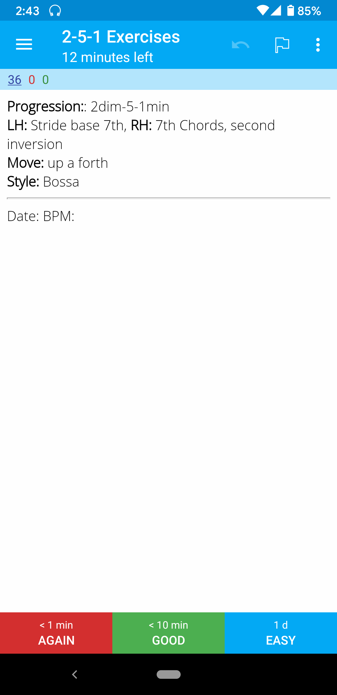
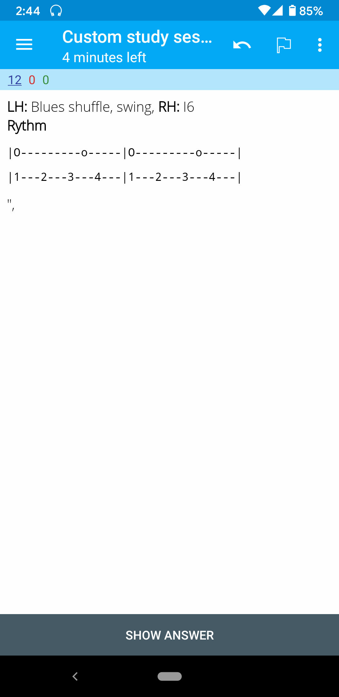

# A python - driven approach to creating music exercises

This repository contains script to create [Anki](https://github.com/ankitects/anki) decks using [GenAnki](https://github.com/kerrickstaley/genanki/) that contain exercises that I find useful when trying to vary my studying.

The scripts create exercise anki APKG files that you then can import into your Anki client and for example do 2 of each deck for 10min every day.

Suggestions for new exercise combinations are welcome.

## 2-5-1 exercises

These exercises are a permutation of different left hand and right hand chord and other patterns, styles, and ways to move over the keys, inspired by [this video](https://www.youtube.com/watch?v=-bH30kwMbm0&t=434s&ab_channel=WalkThatBass)

## Rythm exercises

Here, on-beat and off-beat notes are combined in order to train the different combinations by playing, klapping or thinking.

Enjoy!
